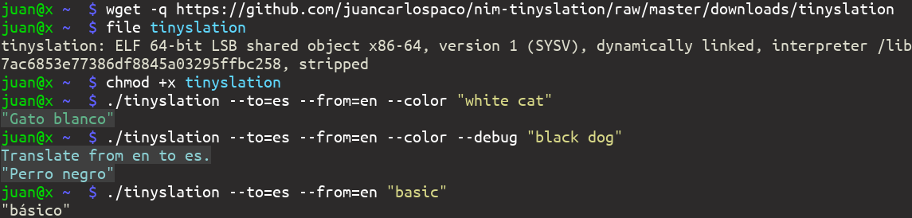

# nim-tinyslation

- Text string translation from free online crowdsourced API.
Tinyslation a tiny translation. Nim package.





# Use

```nim
>>> import translation
>>> echo tinyslation("white cat", to="es")  
"gato blanco"
>>>
```


# Install

```
nimble install translation
```


# Requisites

- [Nim](https://nim-lang.org)


# Documentation

<details>
    <summary><b>tinyslation()</b></summary>

**Description:**
Text string translation from [free online crowdsourced API](http://mymemory.translated.net).
The proc does not accept `char` only `string`.

**Arguments:**
- `text` A text to translate, `string` type, required.
- `to` A target language to translate on ISO 2-char language code, `string` type, eg. `"en"` or `"es"`, required.
- `from` A source language to translate on ISO 2-char language code, `string` type, eg. `"en"` or `"es"`, optional, defaults to `"en"`, required.
- `fallback_value` A fallback value to return when it fails, `string` type, optional,
if omitted and failed to translate then the same string will be returned, required.

**Returns:** A translated text string, `string` type.

</details>
